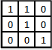
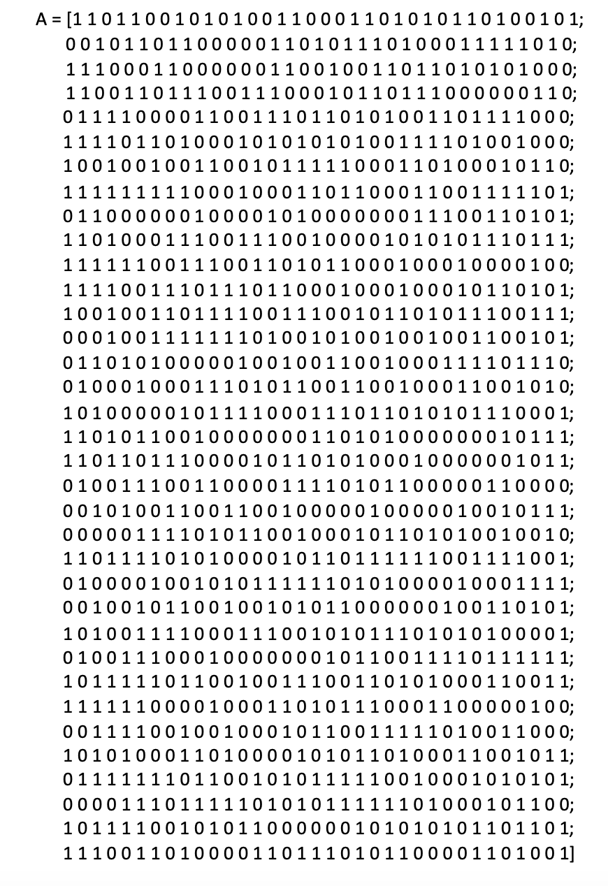

# Weekly Assignment (WA13)

**Due date: November 25 at 11:59pm**

Write a pattern detection algorithm that finds the below pattern (THE ENTIRE NINE CELLS—that is, ALL the 1s AND the 0s, not just the 1s!) in the given A matrix. Your tasks are the following:

- Your algorithm must report the number of patterns found in Matrix A.
- You must print the indices from the specific patterns when you find them along with the count.

