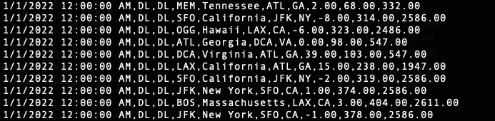
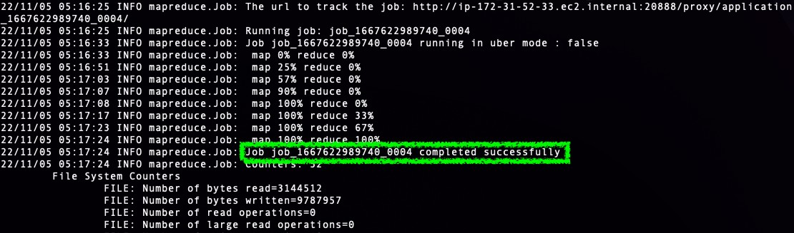
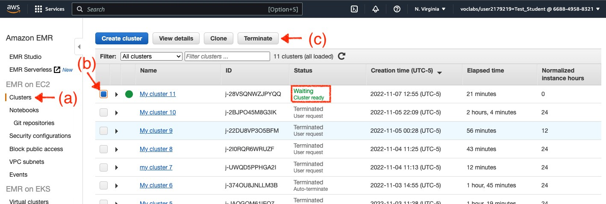

**Due**: As noted on Blackboard

Prerequisites
=============

-   Reviewing class notes for Module 6 – Part 3.

-   Reading Section 11.5 in the course textbook (see Module 6 for a
    complete list of readings for this module).

-   Completing the MapReduce tutorial in AWS Learner Lab (see class
    notes for Module 6 – Part 3).

-   Anaconda python installed (including Anaconda PowerShell)

Background
==========

> In our review of HDFS and Hadoop we introduced MapReduce, a
> programming model and tool for processing and generating large data
> sets that enables fault-tolerant distributed computation. Building on
> principles of functional programming, we examined 3 basic functions,
> namely, map, shuffle & sort, and reduce. We also demonstrated how
> MapReduce works by implementing (in python) a word count of a large
> corpus of text.
>
> In this assignment you will utilize similar processing steps to
> analyze airline flight log data obtained from the U.S. Bureau of
> Transportation Statistics (BTS, [www.bts.gov](https://www.bts.gov/)).
> This data set is comprised of monthly carrier on-time performance
> reporting from January 2022 to August 2022 (one log file per month
> with a total of 8 files) and is given in the comma separated values
> (csv) format. Each record (line) in a log file includes the attributes
> described below (as given by BTS and also provided in the file
> Documentation.csv). A sample from a log file is shown in figure
> [1](#_bookmark0).

-   FL DATE – Flight Date (yyyymmdd)

-   OP UNIQUE CARRIER – Unique Carrier Code. When the same code has been
    used by multiple carriers, a numeric suffix is used for earlier
    users, for example, PA, PA(1), PA(2). Use this field for analysis
    across a range of years

-   OP CARRIER – Code assigned by IATA and commonly used to identify
    a carrier. As the same code may have been assigned to different
    carriers over time, the code is not always unique. For analysis, use
    the Unique Carrier Code

-   ORIGIN – Origin Airport, e.g. ”DCA”

-   ORIGIN STATE NM – Origin Airport, State Name

-   DEST – Destination Airport, e.g. ”JFK”

{width="5.197498906386702in" height="1.275in"}

Figure 1: A sample of an BTS
on-time performance reporting log file

-   DEST STATE ABR – Destination Airport, State Code

-   DEP DELAY – Difference in minutes between scheduled and actual
    departure time. Early departures show negative numbers.

-   ACTUAL ELAPSED TIME – Elapsed Time of Flight, in Minutes

-   DISTANCE – Distance between airports (in miles)

Objective
=========

> You have been tasked by BTS to calculate the **average** departure
> delay for every airport in the data set between January and August
> 2022. Since the number of records is expected to be large (BTS has
> been curating such log data since 1987) you are required to use a
> distributed computing approach (i.e., Hadoop MapReduce). The analysis
> product you are required to deliver is a text file (comma or tab
> separated values) in which each row *i* is a *⟨key~i~, value~i~⟩*
> pair, where *key~i~* is the **origin** airport code (e.g. ”DCA”) and
> *value~i~* is the **average** departure delay in minutes (e.g.,
> ”7.75”). Note that each origin airport code should appear only once in
> the file, and that the file should be sorted alphabetically by the
> airport code.

Approach
========

> Generally, calculating the overall average departure delay
> *d*¯(*A~i~*) for a given airport *A~i~* requires two summed
> quantities: the sum *S* (*A~i~*) of all the flight delays (in minutes)
> at the origin airport (regardless of the airline operating the
> flight), and the sum of the number of flights *N* (*A~i~*) originating
> from that airport. Once these quantities are computed the average
> departure delay is simply given by:

*d*¯(*A* ) = **S (A~i~)**

(1)

> *^i^ N* (*A~i~*)
>
> Finding the sums *S* (*A~i~*) and *N* (*A~i~*) is, in principle,
> similar to word counting. When counting words, a value of 1 is added
> to a “running sum” every time the a given word appears in a text we
> analyze. The same mechanism can be applied to computing both *S*
> (*A~i~*) and *N* (*A~i~*). Specifically, every time a log record
> indicates a flight from airport *A~i~* a value of 1 is added to a
> “running sum” of the flights from that airport, and the departure
> delay is added to a “running sum” of all departure delays from that
> airport (remember, per the goal specified, we are not interested in
> finding the average delay for a specific airline; We are interested
> only in the overall average delay from that airport). Consequently,
> the MapReduce approach used in our word counting example could be used
> here to find *S* (*A~i~*) and *N* (*A~i~*).
>
> Having said that, there is a key difference between our MapReduce word
> counting example and the task at hand. When computing a sum, the order
> of computation does not affect the result since addition is a
> commutative operation. This means that during the reduce step of
> MapReduce partial sums of the data can be computed distributively at
> any order and then combined into a single value. A division operation
> between two values, however, is not commutative i.e. it is required to
> know what both values are from the **entire data set** in order to
> obtain a correct division result. In the context of our objective, it
> is required
>
> to first find what *S* (*A~i~*) and *N* (*A~i~*) are for the entire
> set of log data before *d*¯(*A~i~*) could be calculated for
>
> each airport *A~i~*. One way to accomplish this in a distributed
> computing environment with MapReduce is to apply MapReduce **twice**
> consecutively (also called MapReduce “chaining”):

-   A first MapReduce (“MapReduce–A”) is applied to produce key–value
    pairs

> *⟨A~i~,* (*SumDelays, SumFlights*)*⟩* that are stored in files and
> used as the input for a second MapReduce processing. Here, *SumDelays*
> and *SumFlights* are the **partial** sum of delay times (in minutes)
> and the the **partial** sum (count) of flights for departing flights
> from airport *A~i~* (respectively). The reason why these sums are only
> partial and not the complete sums across all data files is that they
> are calculated separately (and in a distributed parallel fashion) for
> each MapReduce job task. Since addition is commutative, adding these
> partial sums into a single “complete” sum is possible.

-   A second MapReduce (“MapReduce–B”)is applied on the results of the
    first MapReduce. Here, we first need to find the “complete” sum of
    **all** reported flight departure delays *S* (*A~i~*) and the count
    of **all** flights *N* (*A~i~*) that departed from airport *A~i~* in
    our entire data set. Once these quantities are found

> for each airport *A~i~* they can be divided to produce a final result
> in the form of a *⟨key~i~, value~i~⟩* pairs, where *key~i~* is the
> code of airport *A~i~* and *value~i~* is the corresponding **average**
> flight departure delay.
>
> The tasks in this assignment, which are described below, correspond to
> these two consecutive MapReduce steps.

Task 1
======

> Develop and run the mapper and reducer python scripts for MapReduce–A.
> The input for this step is BTS’s on-time performance reporting log
> files from January 2022 to August 2022 and the output is *⟨A~i~,*
> (*delay,* 1)*⟩*.

1.  Modify the class tutorial (word count) script ebook map.py to
    process a stream of log file lines (recieved from stdin) and produce
    for each line a tab–separated tuple *⟨A~i~, delay,* 1*⟩*. Here,
    *A~i~* is the origin airport code (as reported in the logs by
    ORIGIN), *delay* is the flight delay in minutes for the logged
    flight (as reported in the logs by DEP DELAY), and a value 1 is
    added to indicate that the flight delay value is counted as one
    delay time observation. Name your script mapperA.py and include the
    following statement in the first line of the file:
    \#!/usr/bin/python (this line is required to ensure the python
    script will run on the AWS EMR cluster).

2.  Modify the class tutorial (word count) script ebook reduce.py to
    take the tuples *⟨A~i~, delay,* 1*⟩* as input and produce a
    tab–separated tuple *⟨A~i~, SumDelays, SumFlights⟩*, where
    *SumDelays* and *SumFlights* are the a partial sums of delay times
    (in minutes) and flight counts for departing flights from airport
    *A~i~* (respectively) in a MapReduce task. Name your script
    reducerA.py and include the following statement in the first line of
    the file: \#!/usr/bin/python

3.  Test MapReduce–A on your
    own computer using the small sample of log data provided in the file
    test data.csv. Open a terminal (Conda PowerShell on Windows) and
    simulate a hadoop streaming MapReduce task in two steps: first test
    mapperA.py by running the shell command:

> 1 \$ cat test\_data . csv | mapperA . py | sort
>
> In this command cat prints the lines in the file test data.csv to the
> terminal, | (a.k.a as “pipe”) redirects the output of the previous
> operation (e.g., cat or sort) to the next operation in the command
> (like stdin), and sort sorts the redirected input in ascending ASCII
> order. Compare your results to the data in test data.csv and verify
> that the output of your map and reduce scripts (printed to the
> terminal screen) are *⟨A~i~, delay,* 1*⟩* tuples.

1.  Next, test reducerA.py
    by running the following shell command that complete MapReduce–A
    process:

> 1 \$ cat test\_data . csv | python mapperA . py | sort | python
> reducerA . py &gt; Map ReduceA . txt
>
> This command, which sends the output of reducerA.py to the text file
> MapReduceA.txt, should produce the tuples *⟨A~i~,* (*SumDelays,
> SumFlights*)*⟩* as noted earlier. Compare the results to the data in
> test data.csv and verify that they are correct.

Task 2
======

> Develop and run the mapper and reducer python scripts for MapReduce–B.
> The input for this step is the output of MapReduce–A, i.e. tuples of
> the form *⟨A~i~,* (*SumDelays, SumFlights*)*⟩*, and the result of this
> MapReduce process should be tuples *⟨A~i~, d*¯(*A~i~*)*⟩* pairs, where
> *key~i~* is the code of airport *A~i~* and *d*¯(*A~i~*) is the
> corresponding **average** flight departure delay from airport *A~i~*
> calculated over the entire data set.

1.  Modify the class tutorial (word count) script ebook map.py to take
    the tuples

> *⟨A~i~, SumDelays, SumFlights⟩* as input and produce **identical**
> tuples as output. Put differ- ently, the mapper function of
> MapReduce–B should simply copy its input to its output, a process that
> is sometimes referred to as “identity mapping”. Name your script
> mapperB.py and include the following statement in the first line of
> the file: \#!/usr/bin/python.

1.  Modify the class tutorial (word count) script ebook reduce.py to
    take the tuples

> *⟨A~i~, SumDelays, SumFlights⟩* as input and produce a tab–separated
> tuple *⟨A~i~, d*¯(*A~i~*)*⟩*, where *A~i~* is the airport code and
> *d*¯(*A~i~*) is the **average** delay (in minutes) of all flights
> departing from *A~i~* between January and August 2022 (respectively).
> Name your script reducerB.py and include the following statement in
> the first line of the file: \#!/usr/bin/python.

1.  Similarly to the way you tested your MapReducer–A scripts, test
    MapReduce–B on your own computer using the results of Task 1. Open a
    terminal (Conda PowerShell on Windows) and simulate a hadoop
    streaming MapReduce task in two steps: first test mapperB.py by
    running the shell command:

> 1 \$ cat Map ReduceA . txt | mapperB . py | sort
>
> Compare your results to the contents of MapReduceA.txt and verify that
> the output is identical to the contents of MapReduceA.txt.

1.  Next, test reducerB.py
    by running the following shell command that simulates a complete
    MapReduce–B task:

> 1 \$ cat Map ReduceA . txt | mapperB . py | sort | python reducerB .
> py &gt; Map ReduceB . txt
>
> This command, which sends the output of reducerB.py to the text file
> MapReduceB.txt, should produce the tuples *⟨A~i~, d*¯(*A~i~*)*⟩* as
> noted earlier.

1.  Using the data in test
    data.csv calculate manually (e.g., in a spreadsheet) the average
    delay for each airport. Then compare these calculated values to the
    results in MapReduceB.txt in a table and verify that all airports
    are included and all average values were computed correctly.

Task 3
======

> Tasks 1 and 2 should result in 4 python scripts, mapperA.py,
> reducerA.py, mapperB.py, and reducerB.py that have been tested. Using
> these scripts and the log data set provided in this assignment, you
> are now ready to run your MapReduce–A and MapReduce–B jobs in the AWS
> EMR cluster. The first few steps in this task are similar to steps 1–5
> in the class tutorial (see slides 56–66 in the Module 6 – Part 3 class
> notes)
>
> 

1.  Create a new folder named assignment6 on your computer and download
    into it the assignment files from Blackboard. In addition copy the 4
    python scripts you created in Tasks 1 and 2 (as noted above).

2.  Login to your AWS student account and start a learner lab. Remember,
    your lab will run for up to 4 hours. If you run out of time you will
    have to restart a new lab and repeat Task 3.

3.  If you do not have a current EC2 SSH key, or if you would like to
    use a new key for this assignment, please create a new key pair (see
    slides 58–59 in the class notes) copy it to your assignment6 folder.
    If you have an existing (working key) please copy it to that folder.

4.  Create and configure an EMR cluster. Your cluster should be
    configured to be identical to the cluster you configured for the
    class tutorial (see slide 60 in the class notes). When configuring
    your cluster make sure the EC2 key selected matches the key in your
    assignment6 folder. Note that it may take some time (sometimes up to
    10–15 minutes or so) for your cluster to be created.

5.  Set an EC2 inbound security rule to enable an SSH connection to EC2
    instances, as shown in slide 63 of the class tutorial (if you
    already created this rule in the class tutorial you do not need to
    recreate it, however please verify that it still exists).

6.  Return to the EMR
    Clusters page and check if your cluster is active (i.e. ready for
    MapReduce jobs). Active clusters will have a ”Waiting” status
    indicated in the Status column as well as a green disk icon
    {width="0.15160433070866142in"
    height="0.1443853893263342in"} next to the name of the cluster (see
    also Figure [3](#_bookmark12)). Once your EMR cluster is active
    launch a terminal (or Conda PowerShell) window open an SSH
    connection to it’s “Master” node (slides 65–66 in the class notes).
    In the EMR Master node terminal create a new folder named
    flight-data in the home folder you logged into with your
    SSH session.

7.  Open a **second**
    terminal (or Conda PowerShell) on your computer and move to your
    assignment6 directory. Then, using the scp command copy the
    following files to the directory you created step [6](#_bookmark5)
    on your cluster’s Master node:

    -   T ONTIME REPORTING logs 2022.zip (the assignment data set)

    -   mapperA.py

    -   reducerA.py

    -   mapperB.py

    -   reducerB.py

8.  In your EMR Shell (the SSH connection you created in step
    [6](#_bookmark5)) unzip the flight log data with the unzip

> command, which will uncompress the file at its current directory:
>
> 1 \$ unzip T\_ONTIME\_REPORTING\_logs\_ 2022 . zip

1.  Make a new directory for the flight logs in your cluster with HDFS’s
    dfs -mkdir command:

> 1 fs dfs - mkdir flight - data
>
> Then, copy the flight log data files (8 in totoal) to this directory
> with the HDFS’s dfs -put command:
>
> 1 fs dfs - put \*. csv flight - data

1.  Run the MapReduce–A job on your EMR cluster using the Hadoop
    streaming tool by running the following command in your EMR Shell
    (note that the command shown below is split into several lines to
    improve readability, however this command should be typed in the
    Shell window as a single line):

> 1
>
> 2
>
> 3
>
> 4
>
> 5
>
> 6
>
> Once the MapReduce job starts it will begin outputting to the Shell
> window messages about its progress Figure [2](#_bookmark7). Please
> verify that the job was completed **successfully**, as shown in the
> example in Figure [2](#_bookmark7).

{width="5.896874453193351in"
height="1.7371872265966755in"}

Figure 2: Example of a part
of a streaming MapReduce job progress messages

1.  Next, run the MapReduce–B job on your EMR cluster. In this job, the
    output of MapReduce–A is the input, and the result of the job is the
    set of tuples *⟨key~i~, value~i~⟩* pairs, where *key~i~* is the set
    of all airport codes in the data *A~i~* and *value~i~* is their
    corresponding average flight departure delays. Use the following
    command in your EMR Shell to run this MapReduce job (As before, the
    command shown below is split into several lines to improve
    readability, however this command should be typed in the Shell
    window as a single line):

> 1
>
> 2
>
> 3
>
> 4
>
> 5
>
> 6
>
> As before, please verify that this MapReduce job is also completed
> successfully.

1.  Copy the results of the
    two MapReduce jobs from the cluster’s HDFS folders to the Master. In
    your EMR Shell please do the following:

    -   Create a directory named MapReduce-out-A, move into it, and then
        copy the results of MapReduce–A from the HDFS directory
        flight-data-out-A into it using:

> 1  \$ hdfs dfs - get
> flight - data - out -A/\*
>
> Examine the files in flight-data-out-A. It should now include a set of
> output files named part-00000, part-00001, and part-00002. Rename
> these files to part-00000-A.txt, part- 00001-A.txt, and
> part-00002-A.txt.

-   In your EMR Shell return to your home directory and create a
    directory named flight-data- out-B, move into it, and then copy the
    results of MapReduce–B from the HDFS directory flight- data-out-B
    into it using:

> 1 \$ hdfs dfs - get flight - data - out -B/\*
>
> As with the previous job output, rename these files to
> part-00000-B.txt, part-00001-B.txt, and part-00002-B.txt.

1.  Since the output of MapReduce–B includes several files (as described
    in step [12](#_bookmark9)), our last step is to combine these
    results into a single file named flight-delays-2022-avg.txt. This
    can be easily done with the command below. This command utilizes the
    cat, | (pipe), and sort Shell tools to combine the results into a
    single sorted list of airports and their corresponding average
    delays, and then directs it to a file using the &gt; Shell tool (the
    command shown below is split into two lines to improve readability,
    however this command should be typed in the Shell window as a single
    line):

> 1
>
> 2

1.  Using the local
    computer Shell you opened in step [7](#_bookmark6) and the scp
    command, copy the output files of the MapReduce–A and MapReduce–B
    jobs from the AWS EMR Master node to your computer (the files in
    flight-data-out-A and flight-data-out-B directories, see step
    [12](#_bookmark8)). In addition, copy the combined results file
    flight-delays-2022-avg.txt to your computer.

2.  Verify that **all**
    files you copied in step [14](#_bookmark10) were successfully copied
    to your computer (if not, please go back to step [14](#_bookmark10)
    and complete the copying process). Once all files are copied
    terminate your your EMR cluster by appying the following steps
    (Figure [3](#_bookmark12)):

(a) Navigate to the AWS EMR service in your learner lab and click on
    ”Clusters” from the menu on the left side menu. This will bring you
    to the control panel shown in Figure [3](#_bookmark12), which lists
    both active and terminated clusters associated with your lab. Active
    clusters in this list will have a ”Waiting” status indicated in the
    Status column as well as a green disk icon
    {width="0.15160433070866142in"
    height="0.1443853893263342in"} next to the name of the cluster.
    Terminated clusters will have a ”Terminated” status indicated in the
    Status column.

(b) Select the box to the left of your cluster name. Once selected it
    will turn blue.

(c) Click on the ”Terminate” button located on the top of the list. A
    pop–up window asking you to confirm the cluster termination will
    appear, please select ”Terminate” to shutdown your cluster.

(d) End your learner lab.

{width="5.169791119860018in"
height="1.7427077865266842in"}

Figure 3: Terminating an
EMR cluster on AWS

What to submit
==============

> Please submit a **single** zip file with the following files:

-   Task 1:

    -   The python scripts mapperA.py and reducerA.py

    -   The file MapReduceA.txt (step [4](#_bookmark2))

-   Task 2:

    -   The python scripts mapperB.py and reducerB.py

    -   The file MapReduceB.txt (step [4](#_bookmark3))

    -   A table showing the comparison between your manual average
        calculations and the results in MapReduceB.txt (step
        [5](#_bookmark4)). Please prepare your table in Microsoft Word
        and submit it as a single document in PDF format.

-   Task 3:

    -   The MapReduce–A and MapReduce–B output files you copied into
        your computer in step [14](#_bookmark10), including the file
        flight-delays-2022-avg.txt
